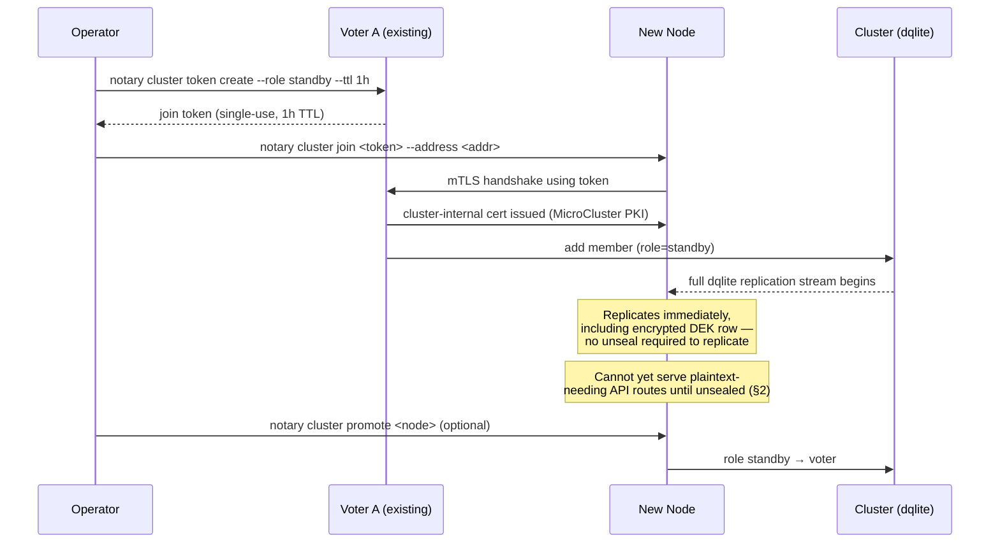
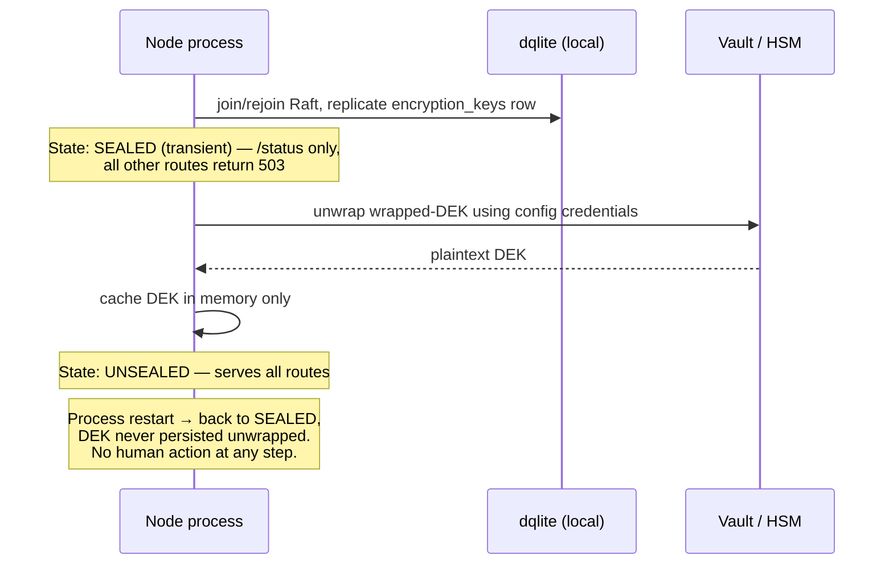
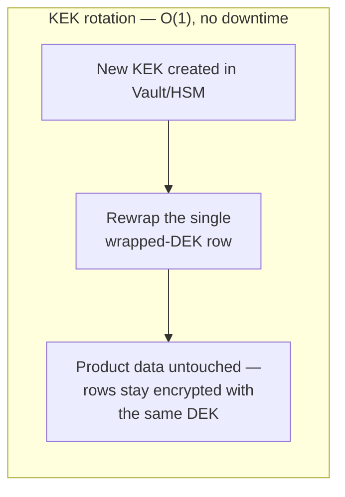
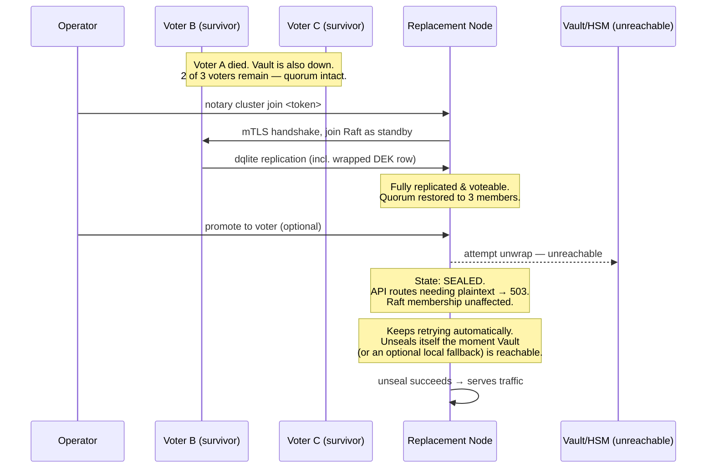

# Notary HA Clustering — Architecture & Design

Status: background/rationale reference. The authoritative specification is `spec.md` in this same
directory — this document explains the reasoning, tradeoffs, and options considered behind the
decisions recorded there; it is not itself the spec.
Scope: distributed-systems design for multi-node HA notary (dqlite + MicroCluster), the
encryption-key lifecycle across a cluster, and OIDC session design. Not an implementation
plan — no code, no task breakdown.

## 0. Grounding: what "today" actually is

Two of the constraints in the brief describe "today's" behavior. I verified both against the
current single-node implementation before designing on top of them, and one doesn't match:

- **OIDC** — Authorization Code flow exists today (`internal/server/handlers_oidc.go`), but it
  is **not** PKCE — there's a server-generated `state` value and no `code_verifier`/`S256`
  challenge. The brief asks for Authorization Code + PKCE, which is a real (small) change from
  current behavior, not a continuation of it. I've designed for PKCE below; flagging it here so
  it isn't read as already-shipped.

- **Unseal UX** — the brief states the manual, per-node, admin-triggered unseal is "the same
  approach already used today." It isn't. Today (`internal/backends/encryption/encryption.go:12`)
  the DEK is unwrapped **automatically on every boot**, driven entirely by config file
  credentials (Vault AppRole/token, PKCS11 PIN) — there is no CLI flag, no `/unseal` endpoint,
  and no human action of any kind. `docs/explanation/security.md` documents this as fully
  transparent to the operator. **Decision: keep it that way.** What works today keeps working —
  the design below extends automatic, config-driven unseal to every node in the cluster
  independently, with no new manual ceremony introduced. That also removes tension #2 (orchestrated
  auto-restart) by construction, since there's no human gate for orchestration to conflict with.
  See §2.1.

- Everything else in "decisions already made" (dqlite, MicroCluster, DEK/KEK envelope,
  stateless JWT) holds up under review; I've noted smaller sharp edges inline where they came up
  (serial number generation, OpenFGA's storage backend, ACME leader affinity).

---

## 1. Cluster lifecycle design

**Superseded by spec.md §1, not just in detail but in mechanism**: everything below in this
section describes a MicroCluster-based design. MicroCluster was dropped entirely partway through
this work — its database access turned out to be transaction-scoped only, with a `Transaction()`
wrapper that re-invokes the caller's closure on retry, caps every attempt at 10 seconds, and
funnels traffic through a single shared connection, none of which is compatible with handing a
real `*sql.DB` to goose and OpenFGA. The replacement, `github.com/canonical/go-dqlite/v3/app`
directly, is a different (and simpler) design, not a patched version of what follows — read this
section for how the reasoning evolved, not as a description of what's being built. Full current
design: spec.md §1.

### 1.1 Bootstrap (first node)

`notary cluster bootstrap` wraps MicroCluster's bootstrap call. This does three things in one
step, and they should not be decomposed into separate operator actions:

1. Generates the cluster-internal PKI (root CA + per-node mTLS cert) that MicroCluster uses for
   inter-node traffic. This is **entirely separate** from notary's product-facing CA/cert
   issuance PKI — different root, different storage, different code path. Nothing about cluster
   membership should ever appear in the certificates table, and nothing about issued certificates
   should ever be verifiable with the cluster's internal root. Keeping these conflated is the
   single easiest way to turn an operational bug into a security incident (e.g. a cluster-join
   token accidentally usable to mint a trusted product certificate), so this separation is worth
   stating as an invariant, not just an implementation detail.
2. Initializes dqlite on that node as the sole Raft voter.
3. Runs the existing goose migrations against the dqlite-backed connection (schema is unchanged —
   see §4).

The node is fully functional (single-node HA, i.e. no HA) immediately after bootstrap. Encryption
seal state is orthogonal to cluster state — see §2.

### 1.2 Joining subsequent nodes

Token-based join, using MicroCluster's primitive directly:

1. Operator runs `notary cluster token create --role voter --ttl 1h` on any existing voter. This
   calls MicroCluster's token API and returns a single-use, time-limited token encoding the
   issuing cluster's join address and a shared secret for the first mTLS handshake.
2. Operator transfers the token out-of-band to the new node (copy-paste, secrets manager,
   provisioning script — notary doesn't need to solve secure token transport, just make the token
   short-lived enough that "copy-paste into a terminal" is an acceptable channel).
3. On the new node: `notary cluster join <token> --address <this-node-addr>`. MicroCluster
   validates the token, performs the mTLS handshake, issues the new node its own cluster-internal
   cert, and adds it to dqlite as a **standby** by default (see 1.3 for why standby, not voter).
4. The new node begins replicating the full dqlite dataset immediately. This includes the
   encrypted DEK row and all encrypted columns — replication does not require the new node to be
   unsealed (see §2.3). It cannot yet serve API requests that touch plaintext key material.

Token defaults: 1-hour TTL, single-use, scoped to one join. Long-lived or reusable tokens are a
standing credential for cluster admission and shouldn't exist.



### 1.3 Voter vs. standby, and role transitions

MicroCluster's three-tier model (voter / standby / spare) maps cleanly onto Raft's real
constraint: consensus latency and quorum math scale with voter count, but read capacity and
failure-tolerance headroom don't need to.

- **Voters** participate in Raft consensus (leader election, log replication, quorum). Every
  additional voter adds an RTT hop to write latency. For notary's write volume this is
  irrelevant in absolute terms, but voter count still bounds how many simultaneous failures the
  cluster survives.
- **Standby** members replicate the full log (so they're instantly promotable) but don't vote.
  They exist so that losing a voter can be healed by *promoting* a standby rather than requiring
  a fresh join, which is both faster and doesn't touch quorum math mid-incident.
- New joins default to standby, not voter. An explicit `notary cluster promote <member>` (or
  auto-promotion, see below) moves a standby to voter. This avoids the failure mode where an
  operator joins a 4th node to a 3-voter cluster without thinking about it and inadvertently
  changes the quorum size (and, transiently, removes fault tolerance — 4 voters tolerate only 1
  failure with the same overhead as 5 tolerating 2).

Recommend enabling MicroCluster's auto-promotion of a standby to voter when a voter is
permanently removed (not just disconnected), so quorum size self-heals without a manual step
whenever spare capacity exists. Auto-promotion should not trigger on a transient disconnect —
only on explicit `remove`.

### 1.4 Minimum cluster sizes

Standard Raft quorum math, N = 2f+1 voters tolerates f simultaneous voter failures:

| Voters | Tolerates | Notes |
|---|---|---|
| 1 | 0 | No HA. Fine for dev/single-tenant, not a recommendation for production. |
| 3 | 1 | **Recommended minimum for HA.** At this write volume, 3 voters plus N standbys for fast recovery is the right default. |
| 5 | 2 | Recommended when the deployment has genuine multi-failure-domain requirements (e.g. spread across 3+ AZs and must survive an AZ loss plus one more node) or where operational reality means restoring quorum takes longer (change-managed environments, air-gapped sites). |

Given low write QPS, the write-latency cost of 5 voters over 3 is negligible — the deciding
factor is purely how much simultaneous failure the deployment needs to survive, not throughput.
I would not recommend going beyond 5 voters; extra fault tolerance is better bought with standby
members (fast promotion) than more voters (permanent consensus overhead). Odd voter counts (3 or
5) should be the documented default and what `promote`/`bootstrap` steer operators toward, but
that's a documentation/default concern, not something worth building dedicated validation logic
for — an operator who ends up with 2 or 4 voters has made an easily-correctable misconfiguration,
not triggered a safety issue, so actively rejecting it in the tooling isn't worth the added
complexity.

Odd counts should still be enforced where MicroCluster already enforces them as part of its own
membership rules (i.e. free), but nothing beyond that needs building.

### 1.5 Removing / replacing a node

`notary cluster remove <member>` (and `--force` for a dead/unreachable node) is a thin passthrough
to MicroCluster's own `remove` primitive — notary doesn't add a bespoke confirmation/quorum-check
layer on top of it. MicroCluster already has to solve "is this removal safe for the cluster" as
part of its own membership model, and reimplementing that logic in notary would just be a second,
possibly-inconsistent copy of the same safety check. If MicroCluster's `remove` refuses, prompts,
or warns, that behavior surfaces as-is through the CLI/API; notary's job is exposing the primitive
cleanly, not second-guessing it.

Replacement = remove the dead member + join a fresh node with a new token (§1.2). A replacement
node starts sealed and unseals automatically per §2 — no admin action required — but as
established in §1.2/§2.3, it participates in Raft and replicates data immediately regardless of
seal state. This is the load-bearing fact for resolving tension #2 in the brief; see §5.

---

## 2. Encryption key lifecycle design

### 2.1 Automatic unseal, extended to the cluster

Per §0, this stays what it is today: fully automatic, config-driven, zero human action. Every
node, on every boot (first join or restart), unwraps its own copy of the wrapped DEK using
config-provided Vault/PKCS11 credentials. Nothing about clustering changes this contract — it's a
pure extension of current per-process behavior to N independent processes. There is no manual
ceremony, no admin-triggered endpoint, and no new UX to design here. This also means tension #2
(orchestrated auto-restart vs. a human gate) doesn't apply — a restarted or replacement node
reseals and reunseals itself the same way it does today, without anyone noticing.

### 2.2 Concrete interface

One DEK, cluster-global, wrapped once, stored as a single row replicated via dqlite like any
other table. The *wrapping* is cluster-wide (one ciphertext), but *unwrapping* is inherently
per-process: each node's notary process independently reconstructs the plaintext DEK in its own
memory, using its own path to the KEK (Vault/PKCS11 credentials can legitimately differ per node
— e.g. an HSM physically attached to specific hosts). This is unchanged from today's single-node
behavior, just running independently on every node.

Between joining the cluster and finishing its own unwrap, a node is transiently "sealed": it
replicates data and participates in Raft (§1.2, §2.3) but refuses API routes that need plaintext.
`GET /status` reports this (`sealed: true` plus role/raft-state) purely for observability — it's
useful during a Vault outage (§5) so operators can see which nodes are affected — but nothing acts
on it; the node keeps retrying its configured backend and unseals itself the moment that backend
is reachable.



### 2.3 New-node join vs. later restarts

- **First join**: the new node receives the wrapped DEK ciphertext via normal dqlite replication
  (it's just a row). It does **not** receive a plaintext DEK from a peer over any channel — peer
  nodes never transmit unwrapped key material to each other, by construction, since the DEK is
  supposed to exist in at most one process's memory at a time per node. The new node unwraps
  independently exactly as it would on any restart (§2.1), which means its Vault/PKCS11 access
  must be provisioned as part of the join runbook (config drop, secrets injection, etc.) — a real
  operational step to document, but not something the join token itself needs to carry.
- **Later restarts**: identical to first join, minus the replication step (data's already local).
  DEK is never persisted unwrapped, so every restart re-triggers unwrap. This matches the
  existing "in-memory only" invariant from the brief exactly — nothing about clustering weakens
  it.

### 2.4 KEK rotation (no data rewrite)

Rotating the KEK only needs to re-wrap the single DEK row — it never touches encrypted product
data. Two paths depending on backend:

- **Vault transit**: Vault's transit engine supports key rotation + `rewrap` natively. Vault
  rotates the KEK version; notary calls `rewrap` on its stored ciphertext, which Vault handles
  server-side without notary ever seeing plaintext. Cheapest possible rotation.
- **PKCS11/HSM**: since every already-unsealed node holds the plaintext DEK in memory, rewrapping
  with a new KEK doesn't require going back through the HSM to decrypt — decrypt-then-reencrypt
  collapses to "encrypt the already-in-memory DEK with the new HSM key," done once (by the Raft
  leader, to avoid concurrent writers) and replicated. Nodes that are currently sealed will pick
  up the new KEK the next time they unseal.

Zero downtime, no node restart required for already-running nodes.



### 2.5 DEK rotation — out of scope for this HA work

DEK rotation doesn't exist today (there's only ever been one DEK, generated once, never rotated),
so introducing it isn't a requirement of making notary HA — it's a separate capability with its
own scope, and bundling it into this work would mean shipping a versioned-key schema and a
leader-affine re-encryption migration that nothing here actually depends on. Noting it as a
**suggested future improvement** rather than designing it in detail now:

- It's the O(n) case (re-encrypting existing rows), unlike KEK rotation's O(1) rewrap-only cost
  above — that asymmetry is the main reason to treat them as separate efforts with separate
  timelines rather than one "key rotation" deliverable.
- If/when it's taken up, the natural shape is: version the wrapped-DEK storage instead of a
  single row, encrypt new writes with the new version, and run the re-encryption of existing rows
  as a single leader-affine background job (a direct consequence of the single-writer/leader
  architecture this HA design already establishes — not a new constraint that design would have
  to invent).
- Worth picking up in its own context once there's an actual driver for it (e.g. a KEK compromise
  response plan that specifically calls for DEK rotation, not just KEK rotation).

Since this is deferred, the `encryption_keys` schema stays a single row for this HA effort — no
versioned-key migration is part of this work (see §4.1).

---

## 3. OIDC integration design

### 3.1 Session model

**Decision: stateless signed JWT, short-lived access token, no server-side revocation list.**

The stated reasons (avoid extra dqlite write load, avoid sticky sessions across nodes) are sound
— session validation becomes a pure signature-verify against a cached JWKS, no DB round-trip, no
node affinity. This is also the simplest option and the one that matches what's already there
today: current JWT sessions (`internal/backends/authentication/jwt.go`) are already fully
stateless — the `jwt_secret` table holds only the signing secret, not any session or revocation
state — so a revocation list would be new state, not a continuation of the existing model. Going
stateless-with-short-TTL rather than adding a revocation table is simple, secure, and the closest
fit to what's already built:

- **Short access-token TTL (recommend: 10–15 min) + refresh.** On refresh, re-validate the user
  still exists/is enabled (one cheap dqlite read, but only at refresh cadence, not per-request —
  this preserves the "avoid load" property almost entirely while bounding the blast radius of a
  stale session to the TTL window).

A server-side revocation list is deliberately not part of this design — it would be new
server-side session state where none exists today, for a "revoke instantly" guarantee nothing in
the current system provides either. If a future hard requirement for instant revocation shows up
(e.g. mandated offboarding SLA), that's a reason to revisit this specific tradeoff then, not a
reason to build it speculatively now.

Refresh token itself: keep it in an httpOnly, Secure, SameSite cookie, scoped to the browser only
— it never needs to touch dqlite. This keeps the "no server-side session state" property intact:
the browser is the only durable store, the server is stateless end to end.

### 3.2 PKCE

Add S256 PKCE to the existing Authorization Code flow (§0 — this isn't in place today). This is
uncontroversial per current OAuth Security BCP guidance (recommended even for confidential
clients) and cheap to add alongside the existing `state` param.

### 3.3 JWKS caching and rotation

Already using `keyfunc` with TTL-based background refresh — keep this, per-node, in-memory, no
need to share across the cluster (refetch from the IdP is cheap and infrequent relative to
request volume). Add explicit handling for the "unknown `kid`" case: on a signature-verify
failure where the JWKS cache doesn't contain the token's `kid`, force one out-of-band refetch
before rejecting — this is the standard way to handle an IdP key rotation landing between cache
refreshes without waiting out the full TTL.

### 3.4 Claims → roles mapping

Recommend a config-file-defined mapping (claim path → notary role) rather than a DB table,
specifically because it should be identical and auditable across every node without a DB
round-trip, and because it's the kind of thing that belongs in GitOps-managed config next to the
provider registration itself. If runtime, UI-editable mapping turns out to be a real requirement
(as opposed to "would be nice"), it can move to a small dqlite table later — but I'd treat that as
a deliberate escalation, not a default, since it adds a DB dependency to every login's claim
resolution for no benefit in the common case.

### 3.5 Multiple providers

Support N configured providers, each with its own issuer/client_id/client_secret/claim-mapping
and its own JWKS cache. User identity is keyed by `(issuer, subject)` — already reflected in the
existing schema's `oidc_subject` column and its uniqueness index, though that index will need to
become `(issuer, oidc_subject)` once more than one provider can issue the same `sub` value
(currently a bare unique index on `oidc_subject` alone, which silently assumes a single IdP).
Login page presents a provider selector when more than one is configured.

---

## 4. Data model implications

### 4.1 Schema

dqlite is wire-compatible with the SQLite driver interface, so the existing goose migrations and
table DDL (`certificate_requests`, `certificates`, `certificate_authorities`, `private_keys`,
`users`, `encryption_keys`, `jwt_secret`, plus `acme_accounts`/`acme_servers`) carry over
unchanged. What changes is the connection layer: the dqlite client driver transparently forwards
every connection — read or write — to the current Raft leader; there is no local/follower read
path (correcting an earlier draft of this document, which assumed one — see spec.md §4.1 and §5).
`SetMaxOpenConns(2)`'s existing single-writer assumption stays valid — it's now enforced by the
Raft leader rather than by SQLite's own file lock.

Getting a `*sql.DB` at all turned out to be its own design question, and went through two more
resolutions after this document was first written before settling: first a proposed patch to
MicroCluster (rejected — no forks of external dependencies), then a custom
`database/sql/driver` adapting MicroCluster's `Transaction()` closure-replay primitive into
something `*sql.DB`-shaped (rejected once MicroCluster's actual retry semantics were traced
through in full: `Transaction()` re-invokes the caller's closure on retry, which is fundamentally
incompatible with a driver exposing a stateful, externally-driven multi-statement transaction
handle — see spec.md §4.1 for the full trace). The resolution that stuck drops MicroCluster
entirely: `github.com/canonical/go-dqlite/v3/app`'s own `Open(ctx, name)` returns a real `*sql.DB`
with no wrapper and none of those constraints, because they were MicroCluster's own choices, not
inherent to dqlite. Full design is in spec.md §1 and §4.1.

One schema-level change is worth making as part of this work, independent of clustering per se:

- **`oidc_subject` uniqueness becomes `(issuer, oidc_subject)`** (§3.5) — needed once multi-IdP
  is real, not a clustering concern.

`encryption_keys` stays a single row for this work — versioning it is only needed for DEK
rotation, which is explicitly out of scope here (§2.5).

### 4.2 Serial-number uniqueness

This is worth flagging as a latent bug independent of HA, not something HA introduces:
`internal/db/db_certificate_authorities.go:233` generates CA cert serials via
`big.NewInt(time.Now().UnixNano())` — wall-clock-derived, with **no DB constraint** enforcing
uniqueness (the `certificates` table has no dedicated `serial_number` column at all; the serial
lives only inside the stored PEM). Under a single Raft leader, all writes are already serialized,
so leader election itself doesn't introduce a *new* collision path — but nanosecond-resolution
wall-clock time is a genuinely weak uniqueness source (clock granularity varies by OS/container
runtime, and it gives zero defense-in-depth if the generation logic ever gets called from two
places, or during a future multi-leader/sharding change nobody's proposed yet but shouldn't be
foreclosed by baking wall-clock serials into the format).

**Recommendation**: switch to a CSPRNG-generated serial (128-bit random, the RFC 5280 /
Let's-Encrypt-style approach used by boulder), and add a `serial_number` column with a `UNIQUE`
constraint so any future regression fails loudly at the DB layer instead of silently issuing a
colliding certificate. This directly answers the brief's question of "how is serial-number
uniqueness guaranteed via the Raft leader" — the honest answer is *the leader's serialization
prevents concurrent-write races, but it was never the thing guaranteeing distinctness of the
generated values in the first place*, and that should be fixed with a proper constraint rather
than leaned on implicitly.

### 4.3 ACME: client, not server

Worth correcting a scoping assumption: notary is an **ACME client** (via `lego`, requesting certs
from an external CA over DNS-01), not an ACME server issuing to others — confirmed in
`internal/acme/acme.go`. There is no order/challenge state machine to keep correct across leader
failover, because notary doesn't operate one.

What *does* need attention under clustering, and doesn't exist today because there's only ever
one process: **in-flight ACME issuance requests need to survive leader failover.** Today, a
DNS-01 polling loop just runs in the one process that started it. In a cluster, if that node
loses leadership (or dies) mid-poll, nothing currently resumes it. Recommend a small
reconciliation loop, gated to run only on the current Raft leader (subscribing to MicroCluster's
leader-change notification): on becoming leader, scan `acme_accounts`/in-flight request state for
anything left in a non-terminal status and resume polling. This is a genuinely new piece of logic
this design introduces — not a reframing of something that already exists.

### 4.4 OpenFGA

OpenFGA runs embedded, in-process, against the *same* SQLite connection as notary's own data
(`internal/backends/authorization/openfga.go`) — its own goose migrations, same file, today.
`InitializeLocalOpenFGA` calls `ofgaSqlite.NewWithDB(database.Conn.PlainDB(), cfg)`, which takes
a generic `*sql.DB` — that part is genuinely driver-agnostic, so authorization data can inherit
the same Raft-replicated consistency as everything else without touching this call site.

**Known, specific incompatibility — resolved to a small mechanical fix, not left as an open
question.** OpenFGA's SQLite storage layer (`pkg/storage/sqlite/sqlite.go` in
`github.com/openfga/openfga@v1.18.3`, notary's pinned version) classifies errors by
type-asserting to `*modernc.org/sqlite.Error` specifically (`errors.As(err, &sqliteErr)` in
`HandleSQLError` and `isBusyError`), then branching on its numeric SQLite result code:

- Constraint violations (`SQLITE_CONSTRAINT`) map to `storage.ErrCollision`, used for duplicate
  tuple-write detection.
- Busy/locked errors (`SQLITE_BUSY`, `SQLITE_LOCKED`, …) trigger a 10x retry loop
  (`busyRetry`) instead of failing outright.

I checked what `github.com/canonical/go-dqlite/v3` (the driver MicroCluster actually uses)
returns instead, rather than leaving this as an assumption: its `driver.Error` is a type alias
for `protocol.Error` — a plain exported `{Code int; Message string}` struct. When the real SQLite
engine inside dqlite raises a genuine error, the driver preserves the raw, standard SQLite result
code in `.Code` (`internal/protocol/errors.go` / `driver/driver.go:driverError`). So both
`errors.As` checks in OpenFGA will miss — different concrete Go type — but the information they
need (the numeric SQLite code) *is* present on the dqlite side, just under a different type.

I originally proposed patching `HandleSQLError`/`isBusyError` directly — upstream, or via a local
vendor fork — since it's a mechanical ~15-line change. That's not the plan: maintaining a fork of
OpenFGA (even a tiny one) isn't acceptable, and `modernc.org/sqlite.Error` can't be constructed
from outside its own package (unexported fields, no public constructor), so there's no way to make
OpenFGA's own type-assertion succeed without touching its source. A later draft moved the fix into
a custom driver instead (inspecting `driver.Error` at the connection level) — also abandoned, once
that whole approach was dropped (§4.1). What actually ships avoids the question entirely rather
than answering it: `canonical/lxd` runs the same OpenFGA-on-embedded-dqlite combination and simply
never hands OpenFGA's own storage package a `*sql.DB` — they implement
`storage.OpenFGADatastore` themselves, backed by their native tables, used read-only for
Check/ListObjects. Notary's authorization model (`OFGAModel`: one object, four hierarchical
relations) turns out to make this unusually cheap — it reduces to reading `users.role_id`, which
is already notary's real source of truth (today it's dual-written into an OpenFGA tuple alongside
`role_id`, a latent consistency hazard this redesign also removes). No error classification of any
kind is needed, because there's no generic SQL traffic through OpenFGA left to classify. Full
shape in spec.md §4.4.

One real wrinkle worth carrying into implementation: for *leadership-loss* specifically (a write
forwarded to a leader that changed mid-request — the case that actually matters most for HA),
go-dqlite's driver returns the stdlib `driver.ErrBadConn` sentinel instead of a SQLite code.
`database/sql` has its own limited built-in retry for `ErrBadConn`, separate from OpenFGA's
busy-loop, and go-dqlite's own source comments flag that this isn't fully safe to retry
transparently for non-idempotent writes. This is a general dqlite-under-load concern, not
OpenFGA-specific, but OpenFGA's write path is one place it'll surface first.

**What to do**: the incompatibility itself is settled — no runtime spike was needed to find it,
static reading of both codebases was decisive. What's still worth a quick runtime smoke-test at
implementation kickoff (not a discovery exercise, a confirmation one): write the same tuple twice
against a real dqlite-backed OpenFGA instance and confirm `ErrCollision` comes back once the code
patch is in place, and exercise write contention to confirm busy-retry fires correctly.

---

## 5. Failure-mode matrix

The brief is right that these shouldn't be lumped into one "is it up" signal — three independent
dependencies, three independent failure surfaces.

| Dependency | Failure | Stays available | Degrades | Recovery |
|---|---|---|---|---|
| dqlite quorum (majority of voters down) | e.g. 2 of 3 voters lost | Reads from surviving minority, if relaxed/local-read mode is enabled (recommended — see below) | All writes (no leader electable) | Restore majority: bring failed nodes back, or force-remove + join replacements once enough voters are reachable to re-form quorum |
| Single voter lost (quorum intact) | 1 of 3, or up to 2 of 5 | Everything — brief write pause (sub-second to seconds) during re-election | Nothing durable | Automatic (Raft re-election); replace the lost node per §1.5 at leisure |
| Vault/HSM unreachable at a node's startup | Correlated with a node loss — the brief's tension #1 | That node still joins Raft, replicates data, and can vote/become leader for consensus purposes — **sealing does not block quorum recovery** (§1.2, §2.3: seal state is orthogonal to Raft membership) | That specific node's API layer refuses plaintext-touching routes (503) until unsealed — cert issuance, key retrieval, etc. on requests routed to it | Vault/HSM recovery unblocks it automatically; an optional local break-glass backend (see below), if configured, unblocks it automatically too, without waiting on Vault at all |
| OIDC IdP unreachable | Provider down or unreachable | Existing sessions keep working until their (short) TTL expires (§3.1); **local username/password login already exists independently of OIDC** (`hashed_password` in `users`, Argon2id) and is unaffected | New logins via that provider; refresh-token renewal for sessions using it | IdP recovery; local admin accounts are the existing break-glass path, not a new one |
| Individual node loss (any role) | Process or host death | Cluster continues (per quorum math above) | Node's own capacity; possible brief write pause if it was leader | Automatic re-election if voter; replace via §1.5 |



**On the correlated-failure tension specifically**: the concrete resolution is that Raft
membership/replication and encryption-seal state are two independent axes, and a node being
sealed was never a reason it couldn't hold data or vote — only a reason it can't answer requests
that need plaintext. That decouples "can we restore quorum" from "is Vault reachable." The one
remaining gap is Vault being the *only* unwrap path: if Vault is down and a node is sealed, that
node genuinely cannot serve API traffic until Vault returns, full stop — still automatic, just
blocked on an external dependency. An optional **local break-glass backend** (a passphrase- or
Shamir-derived key, configured independently of Vault/HSM and tried automatically as a fallback
when the primary backend is unreachable — no human action, same automatic contract as everything
else in §2) would close this gap. This is a key-custody policy question (does a fallback path
that doesn't depend on Vault/HSM undermine the reason Vault/HSM was chosen in the first place?),
not an engineering one, so it's flagged rather than decided here.

---

## 6. Operator UX proposal

### 6.1 CLI

```
notary cluster bootstrap
notary cluster token create [--role voter|standby] [--ttl 1h]
notary cluster join <token> --address <host:port>
notary cluster promote <member>
notary cluster remove <member> [--force]
notary cluster status
```

`cluster status` should print voter/standby role, Raft term/leader, and seal state per member in
one table — this is the single most useful command for an operator during an incident, and it
should not require cross-referencing three different views to answer "are we healthy." Seal state
here is read-only observability (useful during a Vault outage, §5) — there's no unseal command,
because unsealing has no manual step (§2).

### 6.2 Admin API

```
GET    /cluster/members                # list, with role/raft-state/seal-state per member
POST   /cluster/members/tokens          # create a join token
DELETE /cluster/members/{id}            # remove (accepts ?force=true) — passthrough to MicroCluster
POST   /cluster/members/{id}/promote
GET    /cluster/status                  # aggregate health
GET    /status                          # already exists; extend with seal state + raft role
```

No `/unseal` endpoint — nothing in this design needs one.

### 6.3 Web UI

A "Cluster" admin screen:

- Table of members: name/address, role (voter/standby), Raft state (leader/follower), seal state
  (sealed/unsealed badge, observability only), last-seen.
- "Add node" → generates a join token, displays the copyable `notary cluster join …` command
  (token visible once, per standard practice for anything credential-shaped).
- Per-row "Remove" → a standard confirmation dialog, then calls the same `DELETE
  /cluster/members/{id}` passthrough as the CLI — notary doesn't compute or display its own
  quorum projection here; whatever MicroCluster's `remove` does is what happens (§1.5).
- No "Unseal" action anywhere — sealed is a transient, self-resolving state (§2), not something an
  operator acts on.

---

## Decisions settled during review

- **Unseal stays fully automatic** (§2.1) — no manual ceremony, matching current single-node
  behavior extended to every node independently. Resolves tension #2 by construction.
- **Node removal defers entirely to MicroCluster's own `remove`/`--force` semantics** (§1.5) — no
  notary-level quorum-check or confirmation logic layered on top.
- **No enforcement of odd voter counts** (§1.4) — documented as the recommended default, not
  validated/rejected in tooling; not worth the complexity for an easily-corrected misconfiguration.
- **Session model stays stateless, no revocation list** (§3.1) — short-TTL JWT + refresh, matching
  the existing stateless session design rather than introducing new server-side state.
- **DEK rotation is out of scope for this HA work** (§2.5) — it doesn't exist today, so this
  effort isn't the place to introduce it. Noted as a suggested future improvement with a rough
  shape, to be scoped and designed properly in its own context when there's an actual driver for
  it. KEK rotation (§2.4) stays in scope — it's O(1) and doesn't touch product data.

## Still open — needs a decision from outside this document

1. **Break-glass unwrap path** (§5): should an optional local passphrase/Shamir-split fallback
   exist alongside Vault/HSM, tried automatically when the primary backend is unreachable, to
   fully close the correlated-failure gap? This is a key-custody policy question (whether such a
   fallback undermines the reason Vault/HSM was chosen), not an engineering one — flagged, not
   decided here.
2. **Claims-to-role mapping editability** (§3.4): config-file (recommended default) vs.
   UI-editable DB table — only matters if runtime editability is an actual stated requirement.
