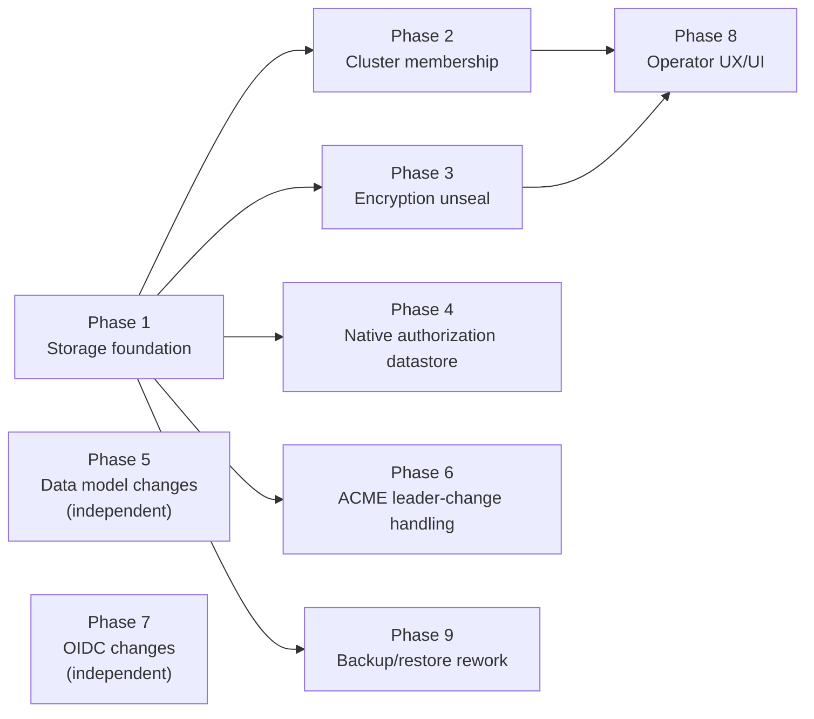

# Notary HA Clustering — Implementation Plan

Status: **Phases 5 and 7 delivered. Phase 1 unblocked, and simpler than earlier drafts of this
plan** — the database-access design in spec.md §1/§4.1 dropped MicroCluster in favor of
`github.com/canonical/go-dqlite/v3/app` directly, which removes the need for any custom driver.
Phase 4 is also simpler than earlier drafts: OpenFGA's own storage backend isn't used at all,
following `canonical/lxd`'s pattern for the same OpenFGA+dqlite combination — see Phase 4.
Builds: `spec.md` in this directory (the specification). This document sequences the work
required to deliver it, against the actual current codebase.

## Sequencing

Phase 1 (storage foundation) gates Phases 2, 3, 4, 6, and 9 — they all need a working
dqlite-backed connection to build against. Phases 5 and 7 (data model, OIDC) touch neither
clustering nor encryption and can run in parallel with everything else from day one. Phase 8 (UI)
depends on Phases 2 and 3's APIs existing.

---

## Phase 1 — Storage foundation (cluster of one)

Goal: swap the storage engine without changing anything above `db.DatabaseRepository`.

### Database access: `app.Open`, directly

Decided in spec.md §1/§4.1: no MicroCluster. `github.com/canonical/go-dqlite/v3/app` — the
lower-level package MicroCluster itself is built on — is used directly. `app.Open(ctx, "notary")`
returns a genuine `*sql.DB`, backed by go-dqlite's own standard driver: real `Begin`/`Commit`, no
replay of a closure, no imposed timeout, connection concurrency notary configures itself
(`app.WithConcurrentLeaderConns`, `app.WithBusyTimeout` — set to match today's
`SetMaxOpenConns(2)`). `sqlair` and goose take it unmodified — this removes the entire
custom-driver problem earlier drafts of this plan had to solve. (OpenFGA doesn't need it at all —
Phase 4 bypasses OpenFGA's own storage layer entirely.)

### Tasks

- Add `github.com/canonical/go-dqlite/v3` to `go.mod` — unforked, imported normally. No
  MicroCluster dependency anywhere in this plan.
- Add the `dqlite` packaging part to `snap/snapcraft.yaml` and `rockcraft.yaml`, and the
  `CGO_CFLAGS`/`CGO_LDFLAGS` build-environment wiring on the existing `notary` Go part — the exact
  part definition is specified in `spec.md` §8, copied from `microceph`'s proven recipe.
- Add a clustered connection path alongside the existing one in `internal/db/db_init.go`.
  `NewDatabase` currently does `sql.Open("sqlite", dbOpts.DatabasePath)`
  (`internal/db/db_init.go:41`); add a second constructor (or a mode switch on `DatabaseOpts`)
  that instead calls `internal/cluster`'s `app.Open(ctx, "notary")` and wraps the result in
  `sqlair.NewDB(...)` exactly as today (`db_init.go:70`) — the rest of `NewDatabase` (goose
  migrations, `PrepareStatements()`) runs unchanged against it.
- New `internal/cluster` package wrapping `app.New(dataDir, app.WithAddress(addr),
app.WithTLS(...), app.WithVoters(3), app.WithStandBys(2))` for bootstrap (spec.md §1.1) —
  generates the cluster-internal PKI (notary's own code, not borrowed from anywhere), and exposes
  the resulting `*app.App` for `db.NewDatabase`'s clustered path (`.Open`) and later phases
  (`.Leader`, `.Handover`, `.Close`) to use. Because the dqlite driver is CGo against Linux-only
  `libdqlite`, this implementation needs a `linux` build tag with a stub elsewhere, so the rest of
  Notary still builds and tests on non-Linux developer machines.
- `notary cluster bootstrap` (new `cmd/cluster.go`, following the existing cobra pattern in
  `cmd/start.go`/`cmd/root.go`).
- Config gains a `cluster.enabled` flag (`internal/config/types.go`,
  `internal/config/initializers.go`). Default `false`: `notary start` on an existing config file
  behaves exactly as it does today until an operator opts in (see "Rollout" below).
- Schema-version check on every startup (spec.md §4.1): before serving traffic, compare this
  node's applied goose migration version against the version active among reachable cluster
  members (readable from any of them); refuse to start on a mismatch, logging which migration is
  out of step. This is the replacement for MicroCluster's own cross-member schema-version gate,
  which isn't present since goose is unmodified. Reused at join time in Phase 2.

**Exit criteria**: `snapcraft`/`rockcraft` build succeeds and the resulting binary starts inside
the confined base image. The entire existing `internal/db/*_test.go` suite passes unmodified
against a single-node dqlite-backed connection — the single highest-value regression gate in this
plan; treat it as a hard gate before Phase 2 starts. A node deliberately started with an
older/newer migration version than the rest of the cluster refuses to start, with a clear log
message naming the mismatch.

> **Build environment.** `libdqlite` is Linux-only (its Homebrew formula is `depends_on :linux`,
> as it requires Linux kernel AIO), so nothing importing `go-dqlite` compiles on macOS. Validate
> clustering work in a Linux container or in CI (Ubuntu + the `libdqlite-dev` PPA), not on a
> developer Mac.

---

## Phase 2 — Cluster membership

This is where the work MicroCluster would otherwise have supplied for free actually lives (spec.md
§1's opening note): join-token issuance, trust distribution, and member bookkeeping. Everything
else — the actual Raft join, role convergence, removal — is a thin wrapper over `app`/`client`
primitives Phase 1 already has access to.

- **Token issuance and validation**: `notary cluster token create` generates a single-use, random,
  TTL-bound token and stores it as a row in `notary.db` (spec.md §1.2). A new admin API endpoint
  (below) validates a presented token — single-use, TTL check — against that row.
- **Trust distribution (the CSR-signing join endpoint)**: the new node generates its own keypair
  and CSR locally, then presents `{token, CSR}` to an existing member's admin API. The handler
  validates the token, signs the CSR against the cluster CA (`internal/cluster`'s PKI, Phase 1),
  and responds with the signed certificate plus the current member address list. This is the one
  genuinely new protocol in this plan — small, but real: it did not exist before and has no
  off-the-shelf equivalent to lean on.
- **Member bookkeeping**: a `cluster_members` table in `notary.db` (node ID → operator-assigned
  name, joined-at), populated when a join completes. `client.NodeInfo` carries only ID, address,
  and role — this table is what makes `notary cluster status` (below) show names instead of raw
  dqlite node IDs.
- CLI (`cmd/cluster.go`): `token create`, `join`, `promote`, `remove [--force]`, `status`
  (spec.md §6.1). `join` drives the new-node side of the CSR-signing exchange above, then calls
  `app.New(..., app.WithCluster(peerAddrs))` to actually join Raft.
- Admin API (new `internal/server/handlers_cluster.go`, wired into `internal/server/router.go`
  alongside the existing `handlers_*.go` files): `/cluster/members`,
  `/cluster/members/tokens`, `/cluster/members/join` (the CSR-signing endpoint above),
  `/cluster/members/{id}`, `/cluster/members/{id}/promote`, `/cluster/status` (spec.md §6.2).
  `DELETE /cluster/members/{id}` calls `app.Handover(ctx)` first if the target is reachable
  (graceful), then `client.Remove` (spec.md §1.5).
- Build a local 3-node dev harness (docker-compose or an equivalent multi-process script) capable
  of bootstrapping, killing, and restarting individual nodes. This harness is reused by Phases 3,
  4, and 6 — build it once here.
- The `POST /cluster/members/join` handler runs Phase 1's schema-version check against the
  requesting node's declared version before accepting the join, rejecting it with a clear error
  otherwise — the same check, applied at the point a new node is admitted, not just at its own
  startup.

**Exit criteria**: the dev harness can bootstrap, join two more nodes via the real token/CSR flow
(not a shortcut), promote/remove them, and `notary cluster status` reports correct names, role,
and Raft state for all three. A join attempt from a node with a mismatched migration version is
rejected with a clear error, not silently accepted.

---

## Phase 3 — Encryption unseal across the cluster

- `requireUnsealed` middleware (`internal/server/middleware.go`), applied to every route except
  `GET /status` and the read-only `/cluster/*` endpoints.
- `encryption.SetUpEncryptionKey` (`internal/backends/encryption/encryption.go:12`) currently
  returns an error on an unreachable backend. Wrap it in a retry loop that keeps the node in
  "sealed" state and keeps retrying in the background instead of exiting the process — this is
  the one behavior change needed to deliver spec.md §5's "recovers automatically" row. Everything
  else about the unwrap logic is unchanged.
- Extend `GET /status` (`internal/server/handlers_status.go`) with `sealed`, `role`,
  `raft_state` fields.

**Exit criteria**: in the Phase 2 dev harness, killing Vault access to one node mid-startup
leaves that node serving `/status` (`sealed: true`) and 503 elsewhere, while the other two nodes
serve normally. Restoring Vault access unseals it with no restart required.

---

## Phase 4 — Native authorization datastore

No OpenFGA patch, no fork, no custom driver, and — the design settled on after comparing notes
against `canonical/lxd`'s own OpenFGA+dqlite integration (spec.md §4.4) — no dependency on
OpenFGA's storage layer at all. `lxd/db/openfga/openfga.go` is the reference: implement
`storage.OpenFGADatastore` directly, backed by the app's own tables, and never call
`ofgaSqlite.NewWithDB`. Notary's model (`OFGAModel`, one object, four hierarchical relations) makes
this a materially smaller lift than LXD's version (~900 lines, translating a real project/group
graph) — notary's equivalent is close to a direct read of `users.role_id`.

- New type in `internal/backends/authorization` (e.g. `roleDatastore`) implementing
  `storage.OpenFGADatastore`, constructed with `*db.DatabaseRepository`:
  - `Read`, `ReadUserTuple`, `ReadUsersetTuples`, `ReadStartingWithUser` — query `users.role_id`
    directly, using `RoleIDToRelation` (`internal/server/authorization.go`) applied in reverse
    (relation → qualifying `role_id` set, given the `admin ⊆ certificate_manager ⊆
certificate_requestor`/`reader` hierarchy already encoded there).
  - `WriteAuthorizationModel`, `ReadAuthorizationModel`, `FindLatestAuthorizationModel`,
    `ReadAuthorizationModels` — serve the compiled-in `OFGAModel` (`schema.go`) from memory.
  - `Write`, `ReadPage`, `CreateStore`, `DeleteStore`, `GetStore`, `ListStores`,
    `WriteAssertions`, `ReadAssertions`, `ReadChanges` — stub to "not implemented," matching LXD's
    implementation exactly (single store, no assertions, no changelog, and tuple writes must never
    happen — `role_id` is the only place a role assignment is written).
- `InitializeLocalOpenFGA` (`internal/backends/authorization/openfga.go`): remove the
  `goose.Up(...)` call against OpenFGA's own migration set entirely (no OpenFGA-owned schema
  exists anymore); remove the `fga.ListStores`/`fga.CreateStore` RPC-based store bootstrap
  (`CreateStore`/`ListStores` are now stubbed) in favor of a fixed store ID constant and setting
  the model directly via the new datastore's `WriteAuthorizationModel`, called once at startup —
  same shape as LXD's `dummyDatastoreULID` pattern.
- Delete `WriteTuple` and `DeleteTuple` (`internal/backends/authorization/openfga.go`) and their
  call sites in `internal/server/handlers_accounts.go` (currently: `CreateUser` followed by
  `WriteTuple("system:notary", relation, userID)`; `UpdateUserRole`/delete followed by
  `DeleteTuple`). This isn't optional cleanup — it closes an existing dual-write hazard between
  `users.role_id` and OpenFGA's tuple store that predates this whole HA effort (if the tuple write
  failed after `CreateUser` succeeded today, the two silently diverge).
- New tests: `Check`/`ListObjects` against every relation in `OFGAModel`, covering the full role
  hierarchy (an `admin` user should satisfy a `reader` check, etc.) — this is the actual
  correctness surface now, replacing the old busy/constraint-classification tests this phase used
  to need. Re-run the existing account-handler tests to confirm role grant/revoke behavior is
  unchanged from the caller's perspective (same HTTP responses), even though the underlying
  mechanism (no more tuple writes) is different.

**Exit criteria**: `Check`/`ListObjects` produce correct results for every relation in the model,
sourced only from `users.role_id`; the account handler tests pass with `WriteTuple`/`DeleteTuple`
removed; no OpenFGA migration runs anywhere in the clustered path.

---

## Phase 5 — Data model changes (independent of clustering) — **done**

Delivered in `internal/db/migrations/00003_serial_number_and_oidc_issuer.sql`.

- `certificates` gains a `serial_number` column with a `UNIQUE` constraint. CA serial generation
  (`internal/db/db_certificate_authorities.go:233`) switches from `big.NewInt(time.Now().UnixNano())`
  to a CSPRNG-generated 128-bit value.
- `users` gains `oidc_issuer`. The unique index on `oidc_subject` alone becomes a composite index
  on `(oidc_issuer, oidc_subject)`. Update the OIDC callback handler
  (`internal/server/handlers_oidc.go`) and the corresponding `db_users.go` queries to read/write
  both columns.

> **Deviation, as implemented.** SQLite cannot `ALTER TABLE ... ADD COLUMN ... UNIQUE`. The
> column is added as `TEXT NOT NULL DEFAULT ''` with a partial unique index
> (`WHERE serial_number != ''`). Rows predating the migration keep `''` and stay outside the
> index, since their serial cannot be extracted from the stored PEM in SQL; every row written
> afterwards carries a real serial and is uniquely constrained.

No dependency on Phases 1–4. Schedule at any point, in parallel, independently of the clustering
track.

---

## Phase 6 — ACME leader-change handling

- New `internal/acme/reconcile.go`, registered via `app.WithRolesAdjustmentHook`. On each
  invocation, compare the reported leader's node ID to this node's own; on a transition to leader,
  scan for ACME-linked `certificate_requests` rows not in a terminal status and mark them `Failed`
  with an internal-interruption reason. No resume logic — spec.md §4.3 has the reasoning.

**Exit criteria**: in the dev harness, killing the current leader mid-poll of a DNS-01 challenge
results in the affected request surfacing as `Failed` within one leader-election cycle. Also add
a regression test confirming that during a simulated quorum loss (majority of voters killed),
both reads and writes fail cleanly with a clear error — this is the expected, final behavior per
spec.md §5, not a gap to close.

> **Deviation, as implemented.** The quorum-loss regression test
> (`internal/server/quorum_loss_test.go`) injects the condition rather than killing voters:
> killing a majority needs several hosts running real dqlite nodes, which no test environment
> here has. The cluster node reports every membership query as unreachable and the repository's
> connection is closed under the running server, which is what handlers see during a partition.
> It asserts reads and writes fail with a server error and that `/status` still reports the
> node's Raft state. Making `/status` answer at all in that state was a fix, not an assertion:
> it previously returned an empty `500`, having gated the whole response on a database read.

---

## Phase 7 — OIDC changes (independent of clustering) — **done**

- PKCE (S256): `internal/server/handlers_oidc.go` generates and stores a `code_verifier` tied to
  the existing `state` value, sends `code_challenge` on the authorization request, verifies on
  callback. `StateStore.Consume` also makes each `state` strictly one-time-use.
- JWKS `kid`-miss handling: on a signature-verify failure where the token's `kid` isn't in the
  cached JWKS, force one out-of-band refetch before rejecting. Implemented as an explicit
  `keyfunc.Override{RefreshInterval, RefreshUnknownKID}`; the underlying default was already a
  5-minute limiter, now tightened to 30s and made visible.
- Multi-provider config: `internal/config/types.go` changes from a single OIDC provider config to
  a list (issuer/client_id/client_secret/claim-mapping per entry);
  `internal/config/initializers.go` validation updated accordingly. UI login page (`ui/`) gains a
  provider selector when more than one is configured. The single-mapping config form still parses,
  so existing deployments need no config change. Provider selection travels as
  `/api/v1/oauth/login?provider=<name>` and is pinned into the state entry so the shared callback
  resolves the same provider. Claim → role mapping (spec.md §3.4) is applied at auto-provision
  time by `resolveRoleFromClaims`.

No dependency on clustering; can run in parallel with Phase 5 and with the clustering track.

---

## Phase 8 — Operator UX / Web UI

- "Cluster" admin screen in `ui/`, consuming the Phase 2 admin API: member table, add-node flow
  (join token + copyable command), remove-node confirmation, seal-state badges (spec.md §6.3).

**Exit criteria**: an admin can bootstrap, join, promote, remove, and observe seal state
end-to-end through the UI alone, no CLI required.

---

## Phase 9 — Backup and restore rework

- `notary backup`, for clustered deployments, calls `client.Dump(ctx, dbname)`
  (`github.com/canonical/go-dqlite/v3/client`) against the current leader and packages the
  returned main+WAL files into the same tar.gz format `CreateBackup` produces today
  (`internal/db/db_init.go`).
- `notary cluster restore` implements the disaster-recovery procedure from spec.md §7: refuse to
  run on a node that still holds cluster state, bootstrap a fresh single-node cluster, and load
  the dump into it by replaying its schema and rows over SQL (`db.CopyDatabase`) rather than by
  importing files into the data directory, which go-dqlite's default memory mode would ignore.
  The membership records the backup carried are replaced with the restored node; the remaining
  nodes rejoin from wiped state directories with `notary cluster join`.
- The existing single-file `CreateBackup`/`RestoreBackup` path is retained unchanged for
  non-clustered (`cluster.enabled: false`) deployments — no change needed there.

**Exit criteria**: in the dev harness, `notary backup` on the leader produces a tar.gz; a full
`notary cluster restore` against it, starting from zero nodes, reproduces the pre-backup dataset.

---

## Testing strategy

- **Regression**: the existing test suite must stay green throughout — baked into every phase's
  exit criteria above, not a separate end-of-project pass.
- **Multi-node integration harness**: built once in Phase 2, reused by Phases 3, 4, 6, and 9.
- **Chaos/failure-injection tests**, mapped one-to-one to spec.md §5's failure-mode table: kill a
  minority of voters, kill a majority of voters (assert both reads and writes fail cleanly), kill
  the leader specifically, make Vault/HSM unreachable at a node's startup, make the OIDC IdP
  unreachable, kill any single non-voter node. Each row becomes an actual automated test.

---

## Rollout: existing single-node deployments

Existing deployments run on a plain SQLite file via `modernc.org/sqlite`, with no dqlite involved.
`cluster.enabled` defaults to `false` (Phase 1), so `notary start` against an existing config and
database file is unaffected by any of this work until an operator opts in.

No import/adoption tool is built to carry existing data from that plain SQLite file into a dqlite
cluster. Notary has no production deployments yet, so there is no existing data that needs to
survive the transition — an operator turning on `cluster.enabled` starts from an empty database.
If this changes once notary has real deployments, an adoption path can be added then; it is not
speculative scope here.
