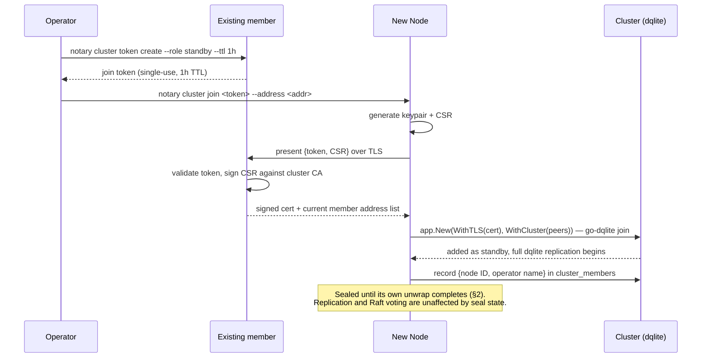
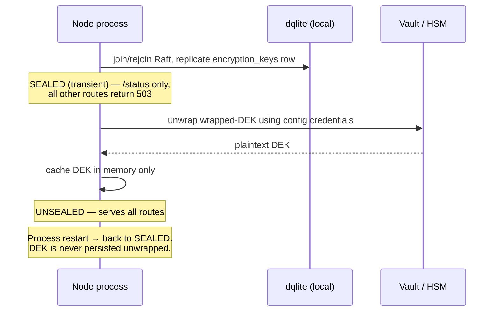
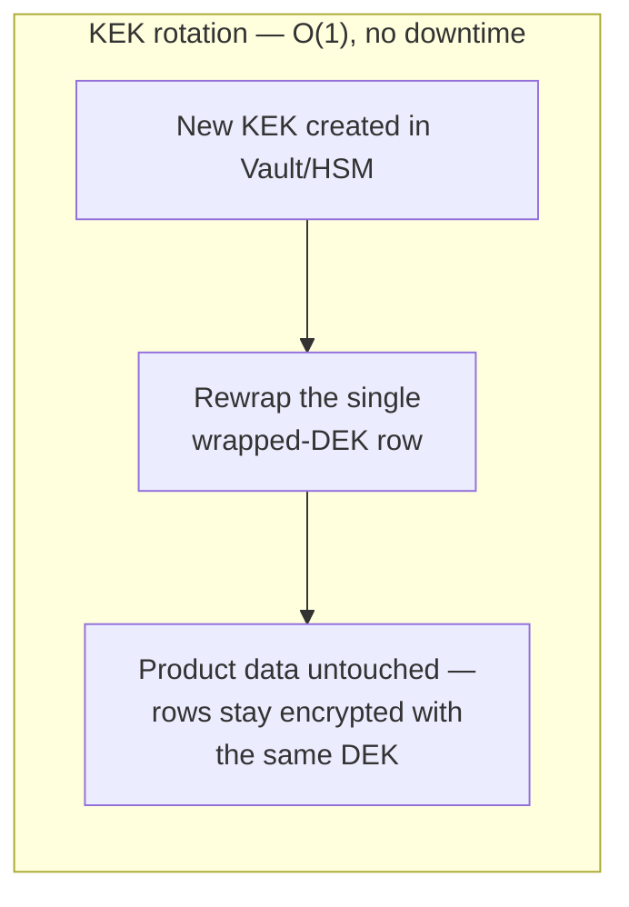
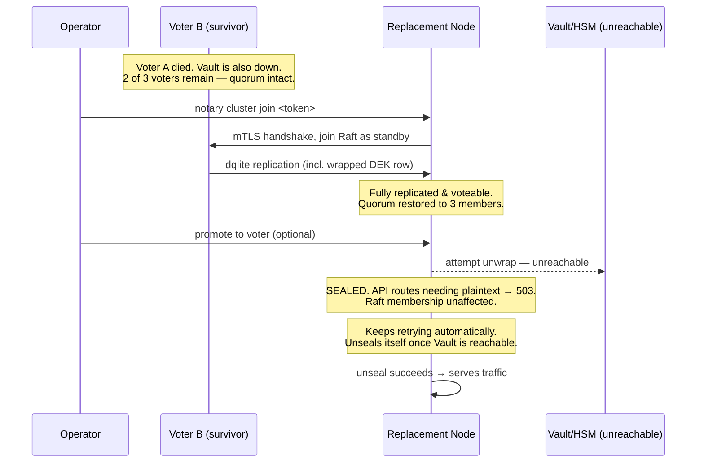

# Notary HA Clustering — Specification

Status: design finalized
Supersedes: this is the authoritative specification for the work. `design.md` in this same
directory is background/rationale material — useful for understanding _why_, not a second source
of truth for _what_. `ha-proposal.md`, also in this directory, is a narrative Abstract/Rationale/
Specification-style write-up of the same design for review/circulation — same status relative to
this document as `design.md`. Where any of them differ, this document wins.

This specification covers: cluster lifecycle (dqlite, via `github.com/canonical/go-dqlite/v3/app`
directly — no MicroCluster, see §1's note), encryption key lifecycle, OIDC authentication, the
resulting data model changes, system behavior under failure, and the operator-facing CLI/API/UI
surface.

---

## 1. Cluster lifecycle

**Not MicroCluster — `go-dqlite/v3/app` directly.** An earlier draft of this specification built
cluster membership on MicroCluster. That's dropped: MicroCluster's database access is
transaction-scoped only, and its `Transaction()` wrapper re-invokes the caller's closure up to 251
times on transient errors, caps every attempt at 10 seconds, and funnels all traffic through a
single shared connection also used for MicroCluster's own heartbeats — none of which is
compatible with handing `*sql.DB` to goose, which needs genuine multi-statement transactions with
normal semantics (§4.1 has the full trace). OpenFGA no longer touches the SQL connection at all
(§4.4), but goose alone is enough to require this.

`github.com/canonical/go-dqlite/v3/app` (the lower-level package MicroCluster itself is built on)
covers most of what MicroCluster would otherwise have provided directly: bootstrap (`app.New`),
join (`app.WithCluster`), mTLS (`app.WithTLS`), automatic voter/standby role convergence
(`app.WithVoters`, `app.WithStandBys`, `app.WithRolesAdjustmentHook`), graceful leadership handover
(`app.Handover`), and cluster membership operations via its `client.Client`
(`Add`/`Assign`/`Remove`/`Dump`). Critically, `app.Open(ctx, name)` returns a genuine `*sql.DB` —
go-dqlite's own driver, no wrapper, none of MicroCluster's replay/timeout/single-connection
constraints — which is what makes §4.1's resolution possible at all.

What notary owns that MicroCluster would otherwise have supplied: **join-token issuance, trust
distribution (getting cluster-internal PKI material to a new node), and member bookkeeping**
(associating an operator-facing name with a raw dqlite node ID/address — `client.NodeInfo` carries
neither). That's the genuinely new engineering surface this introduces; everything else below is a
comparatively thin layer over `app`/`client` primitives that already exist.

### 1.1 Bootstrap

`notary cluster bootstrap` performs, as a single atomic operator action:

1. Generates the cluster-internal PKI (root CA + per-node mTLS certificate) — notary's own code,
   fed into `app.WithTLS(...)`. This PKI is fully separate from notary's product-facing
   CA/certificate-issuance system: separate root, separate storage, separate code path. No
   cluster-membership credential is ever accepted as input to product certificate issuance, and
   no issued product certificate is ever valid against the cluster's internal root.
2. Calls `app.New(dataDir, app.WithAddress(addr), app.WithTLS(...), app.WithVoters(3), app.WithStandBys(2))`
   with no `app.WithCluster(...)` — this is what makes it a bootstrap rather than a join. The node
   comes up as the sole Raft voter.
3. Runs the existing goose migrations against `app.Open(ctx, "notary")`'s `*sql.DB` (§4.1). The
   schema is unchanged by clustering itself (see §4).

The node serves traffic immediately after bootstrap, once its DEK unwrap completes (§2).

### 1.2 Joining a node

There is no MicroCluster token API to build on here — this is the "net-new work" flagged in §1's
opening note, and it's the one piece of this design with no ready-made library primitive
underneath it. The shape:

1. On any existing member: `notary cluster token create --role standby --ttl 1h` generates a
   single-use, random, time-limited token and stores it (a row in `notary.db`, so it's visible to
   whichever member the new node happens to contact — see below).
2. The operator transfers the token to the new node out-of-band (secrets manager, provisioning
   script, or direct copy-paste — the short TTL is what makes this an acceptable channel, not the
   transport mechanism), along with the address of at least one existing member to contact.
3. On the new node: `notary cluster join <token> --address <existing-member-addr>`. The new node
   generates its own keypair and a CSR, and presents `{token, CSR}` to the existing member's admin
   API over plain TLS (server-authenticated only — the token itself is what's proving the new
   node's legitimacy at this point, the same trust model a join token inherently requires). The
   existing member validates the token (single-use, checks TTL), signs the CSR against the cluster
   CA, and responds with the signed certificate plus the current member address list.
4. The new node now holds a valid cluster-internal certificate and the peer list, and calls
   `app.New(dataDir, app.WithAddress(addr), app.WithTLS(...), app.WithCluster(peerAddrs))`. This is
   go-dqlite's own join: the new node contacts a peer, is added to the Raft configuration with role
   **standby** by default, and dqlite handles the actual log replication from there.
5. Once `app.New` returns, notary records the operator-assigned name against the new member's
   dqlite node ID in a small `cluster_members` table in `notary.db` (§1's opening note — raw
   `client.NodeInfo` carries only ID/address/role, no name) — this is what `notary cluster status`
   (§6.1) displays.
6. The node immediately begins full dqlite replication, including the encrypted DEK row and all
   encrypted columns. Replication does not require the DEK to be unwrapped. The node serves no
   product API routes that require plaintext key material until its own unwrap completes (§2).

Join tokens are single-use and scoped to one join. No long-lived or reusable join credential
exists.



### 1.3 Voter and standby roles

- **Voter**: participates in Raft consensus (leader election, log replication, quorum). Every
  additional voter adds one RTT hop to write latency.
- **Standby**: replicates the full log but does not vote. Exists so that a lost voter is healed
  by promotion, not a fresh join.
- New members join as standby. Role convergence toward the configured targets
  (`app.WithVoters(3)`, `app.WithStandBys(2)`) is go-dqlite's own automatic behavior — it
  continuously adjusts roles (`app.WithRolesAdjustmentFrequency`) to move members toward those
  targets as membership changes, including promoting a standby when a voter is permanently removed.
  `notary cluster promote <member>` exists as an explicit override for cases an operator wants to
  force ahead of the automatic convergence interval, not as the primary mechanism.

### 1.4 Cluster size

| Voters | Tolerates simultaneous failures | Use                                                                                                                   |
| ------ | ------------------------------- | --------------------------------------------------------------------------------------------------------------------- |
| 1      | 0                               | No HA. Development only.                                                                                              |
| 3      | 1                               | Default for production HA.                                                                                            |
| 5      | 2                               | Deployments spanning 3+ failure domains, or where restoring quorum is slow (change-managed, air-gapped environments). |

3 is the default (`app.WithVoters(3)`). 5 is the ceiling — additional fault tolerance beyond 5 is
bought with standby members (fast promotion), not more voters (permanent consensus overhead). Odd
voter counts are the documented default and target; notary's tooling does not add its own
validation to reject an operator-configured even count — not worth the complexity for an
easily-corrected misconfiguration.

### 1.5 Removing and replacing a node

Member removal is disabled. dqlite accepts any certificate signed by the cluster CA and does not
authorize it against current Raft membership; every admitted member can also read the encrypted CA
signing key after unsealing. Removing only the Raft record would therefore leave the removed host
trusted. Until coordinated PKI rotation or membership-bound authorization is implemented, excluding
a member requires rebuilding the cluster and isolating every host that held its credentials.

---

## 2. Encryption key lifecycle

### 2.1 Unseal

DEK unwrap is fully automatic on every node, on every boot (first join or restart), driven by
config-provided Vault/PKCS11 credentials. There is no manual unseal ceremony, no CLI unseal
command, and no `/unseal` API endpoint. This is unchanged from the current single-node behavior,
extended to run independently on every node in the cluster.

Between joining/restarting and finishing its own unwrap, a node is transiently sealed: it
replicates data and participates in Raft, but returns 503 on any route that requires plaintext
key material. `GET /status` reports `sealed: true` plus role/raft-state for observability. Nothing
acts on this signal automatically beyond the node's own continuous retry of its configured
backend — the node unseals itself the moment that backend becomes reachable.



### 2.2 Key structure

One DEK, cluster-global, wrapped once, stored as a single row (`encryption_keys`) replicated via
dqlite. Unwrapping is per-process: each node reconstructs the plaintext DEK independently, using
its own configured path to the KEK. Vault/PKCS11 credentials may differ per node (e.g. an HSM
attached to specific hosts). Nodes never transmit unwrapped key material to each other — a
newly-joined node receives the wrapped ciphertext through normal dqlite replication and unwraps it
independently, exactly as it would on any restart. Vault/PKCS11 access must be provisioned as part
of the node's own configuration before or during join.

### 2.3 KEK rotation

Rotating the KEK re-wraps the single DEK row only; it never touches encrypted product data.

- **Vault transit**: Vault rotates the KEK version; notary calls `rewrap` on the stored
  ciphertext. Vault handles this server-side without notary seeing plaintext.
- **PKCS11/HSM**: every already-unsealed node holds the plaintext DEK in memory, so rewrapping
  with a new KEK is "encrypt the in-memory DEK with the new HSM key" — done once, by the Raft
  leader, and replicated. Currently-sealed nodes pick up the new KEK on their next unwrap.

Zero downtime. No node restart required.



### 2.4 DEK rotation — not included

DEK rotation is not part of this work. There is one DEK, generated once, never rotated, matching
current behavior. `encryption_keys` remains a single row; no versioned-key schema is introduced.
If DEK rotation is required in the future, it will be specified and scoped separately.

### 2.5 Break-glass fallback — not included

No local passphrase/Shamir-split fallback unwrap path is included. If Vault/HSM is unreachable, a
sealed node stays sealed until it recovers (§5). Adding a fallback path is a key-custody policy
decision to be made separately, not part of this specification.

---

## 3. OIDC authentication

### 3.1 Session model

Sessions are stateless, HMAC-signed JWTs. Access tokens expire after 10–15 minutes. Refresh uses
the OIDC provider's refresh token, held in an httpOnly, Secure, SameSite cookie scoped to the
browser — it is never written to dqlite. On refresh, the server re-validates that the user still
exists and is enabled (one dqlite read, at refresh cadence only, not per-request).

There is no server-side session store and no revocation list, by design, not by omission: a
revocation check would require either a per-request dqlite read (defeating the goal of keeping
request-path load off the single Raft leader) or a write on every logout/revocation event
(reintroducing the sticky-write-load problem statelessness exists to avoid). A session cannot be
revoked before its access token expires; the maximum exposure window is the access-token TTL.

Instant revocation (e.g. a mandated offboarding SLA, or responding to a detected credential
compromise) is not a gap in this design to be filled in later — it is a different design, with a
different tradeoff (server-side session state), and is out of scope here. If it becomes a real
requirement, it should be specified separately, the same way DEK rotation (§2.4) and the
break-glass unwrap path (§2.5) are.

### 3.2 Authorization Code + PKCE

The OIDC login flow uses Authorization Code with PKCE (S256), in addition to the existing `state`
parameter.

### 3.3 JWKS

JWKS is cached per-node, in-memory, with TTL-based background refresh. On a signature-verify
failure where the token's `kid` is not in the cache, the node performs one out-of-band refetch
before rejecting the token.

### 3.4 Claims → role mapping

Claim-path-to-role mapping is defined in the config file, one entry per configured provider. It
is not stored in the database and not editable at runtime through the UI.

### 3.5 Multiple providers

Any number of OIDC providers may be configured simultaneously, each with its own
issuer/client_id/client_secret/claim-mapping/JWKS cache. User identity is keyed by
`(issuer, subject)`. The login page shows a provider selector when more than one provider is
configured.

---

## 4. Data model

### 4.1 Schema

The existing table DDL (`certificate_requests`, `certificates`, `certificate_authorities`,
`private_keys`, `users`, `encryption_keys`, `jwt_secret`, `acme_accounts`, `acme_servers`) is
unchanged by clustering — dqlite is wire-compatible with the existing SQLite driver interface. The
connection layer changes: every connection, read or write, is routed to the current Raft leader
(`github.com/canonical/go-dqlite/v3`'s driver opens all connections through its leader connector —
there is no local/follower read path). The existing `SetMaxOpenConns(2)` single-writer assumption
remains valid, now enforced by the Raft leader rather than SQLite's file lock.

**Database access primitive: `app.Open`, no wrapper.** As covered in §1's opening note, notary
does not go through MicroCluster's `Transaction()` for its own data. `app.Open(ctx, "notary")`
(`github.com/canonical/go-dqlite/v3/app`) returns a genuine `*sql.DB`, backed by go-dqlite's own
standard `database/sql/driver` implementation — real `Begin`/`Commit`/`Rollback`, no replay of a
closure, no imposed timeout, no artificial connection cap beyond what notary itself configures.
`sqlair.NewDB(...)` wraps it exactly as it wraps the current `modernc.org/sqlite` connection today
(`internal/db/db_init.go:70`). This is what goose and `sqlair` need it for — the remaining hard
`*sql.DB` dependency once OpenFGA is out of the picture (§4.4: OpenFGA no longer touches the SQL
connection at all, so it's no longer part of the reason `app.Open` is needed — it just also
benefits from not being a special case).

Connection concurrency is notary's own call, via `app.WithConcurrentLeaderConns`/
`app.WithBusyTimeout` at `app.New` time — set to match today's `SetMaxOpenConns(2)`, not
inherited from anything MicroCluster would have imposed.

Notary's product data — including the authorization data OpenFGA's Check/ListObjects engine reads
(§4.4) — lives in `notary`, the single database name this node's `app.App` opens. There is no
separate MicroCluster membership database to keep apart from it; cluster membership state
(voter/standby roles, node IDs) lives inside dqlite's own Raft configuration, not in a SQL table
notary owns or touches.

**Schema-version consistency across nodes.** Migrations run through goose, unchanged, rather than
through a MicroCluster-style cross-member schema-version gate — nothing built into the storage
layer stops a node with a different set of applied migrations from joining or starting inside an
existing cluster. This is closed explicitly rather than left as a gap: at join, and at every
subsequent startup, a node compares its own applied goose migration version against the version
currently active among reachable cluster members, and refuses to join or start on a mismatch,
logging the specific migration that's out of step. This is what makes rolling upgrades safe without
relying on a mechanism notary doesn't have — an operator upgrades nodes one at a time, in a defined
order, and a node that would otherwise start with a stale or ahead-of-cluster schema simply won't.

Two schema changes are made:

```sql
-- Multi-provider OIDC identity
DROP INDEX idx_users_oidc_subject;
CREATE UNIQUE INDEX idx_users_oidc_issuer_subject
ON users(oidc_issuer, oidc_subject)
WHERE oidc_subject IS NOT NULL;
-- requires adding an oidc_issuer column to users

-- Certificate serial number: dedicated column + uniqueness constraint
ALTER TABLE certificates ADD COLUMN serial_number TEXT NOT NULL UNIQUE;
```

`encryption_keys` is not changed — it remains a single row (§2.4).

### 4.2 Certificate serial numbers

CA certificate serials are generated with a CSPRNG (128-bit random value), not
`time.Now().UnixNano()`. The new `serial_number` column carries a `UNIQUE` constraint, enforced at
the database layer. Single-leader write serialization already prevents concurrent-write races;
the constraint exists as defense-in-depth against the generator itself, independent of clustering.

### 4.3 ACME requests on leader change

Notary is an ACME client, not a server — there is no order/challenge state machine to keep
correct. What is added: `app.WithRolesAdjustmentHook(func(leader client.NodeInfo, cluster
[]client.NodeInfo) error)` fires with the current leader's `NodeInfo` whenever go-dqlite adjusts
roles; notary's hook compares `leader.ID` against its own node ID to detect that it has just
become leader, and on that transition scans for any ACME-backed certificate request left in a
non-terminal, in-progress state by the previous leader and marks it **Failed**, with a reason
indicating an internal interruption. The request is not resumed. This surfaces through the
existing certificate request status/API exactly like any other failure, and the user re-submits
the request.

This is a deliberate choice over resuming the in-flight workflow: resuming would require
reconstructing `lego`'s in-memory order/challenge state from DB rows alone, on a code path that's
rare enough to be poorly exercised, with real failure modes if done wrong (re-publishing a DNS-01
challenge record mid-validation, duplicate orders against the external CA's rate limits). Failing
cleanly and letting the user retry is simpler, has no such failure modes, and costs the user one
resubmission for what should be a rare event (a leader change coinciding with an in-flight
request). Detection still requires the leader-change hook — without it, an orphaned request would
sit in a non-terminal state indefinitely with no indication anything went wrong.

### 4.4 OpenFGA

**OpenFGA's own storage backend is not used at all.** Not adapted, not patched, not forked —
bypassed. This follows the pattern `canonical/lxd` uses for the same combination of OpenFGA +
embedded dqlite (`lxd/db/openfga/openfga.go`): implement OpenFGA's `storage.OpenFGADatastore`
interface directly, backed by notary's own existing tables, and never call
`ofgaSqlite.NewWithDB`/run OpenFGA's own migrations at all. The OpenFGA _server_ (the Check/
ListObjects graph-evaluation engine, driven by `OFGAModel` in
`internal/backends/authorization/schema.go`) is still used — only its storage layer is replaced.

Notary's authorization model turns out to make this unusually clean. `OFGAModel` defines exactly
one object (`system:notary`) with four hierarchical relations (`admin` ⊆ `certificate_manager` ⊆
`certificate_requestor`/`reader`) — there is no per-resource ACL graph to translate, unlike LXD's
project/group model. Role assignment already has a single source of truth: `users.role_id`
(`internal/db/types.go`), written by `CreateUser`/`UpdateUserRole`. **Today, that source of truth
is dual-written**: `handlers_accounts.go` calls `env.Database.CreateUser(...)` (writes
`role_id`) and then separately `env.AuthzRepository.WriteTuple("system:notary", relation,
userID)` (writes the same fact into OpenFGA's own tuple store), using `RoleIDToRelation` to
convert between the two representations. This is a real, already-existing consistency hazard,
independent of HA: if the tuple write fails after `CreateUser` succeeds, `role_id` and OpenFGA's
tuple store silently diverge — a user with no note that their apparent permissions and their
actual role have drifted apart.

**Resolution: derive tuples from `users.role_id` at read time; delete the write path entirely.**
A new type in `internal/backends/authorization` implements `storage.OpenFGADatastore`,
constructed with notary's existing `*db.DatabaseRepository`:

- `Read`/`ReadUserTuple`/`ReadUsersetTuples`/`ReadStartingWithUser` — the only methods that do real
  work — answer directly from `users.role_id`, using the same `RoleIDToRelation` mapping already in
  `internal/server/authorization.go`, applied in reverse (relation → the set of `role_id` values
  that satisfy it, given the hierarchy). These are the same ordinary `db_*.go`-style reads used
  everywhere else in notary — no special driver handling, no error-type inspection, because there's
  no generic SQL layer of OpenFGA's own sitting in between anymore.
- `WriteAuthorizationModel`/`ReadAuthorizationModel`/`FindLatestAuthorizationModel`/
  `ReadAuthorizationModels` serve the single compiled-in `OFGAModel` from memory — it doesn't
  change at runtime, so these are simple accessors, not real storage.
- Everything else `storage.OpenFGADatastore` requires — `Write`, `ReadPage`, `CreateStore`/
  `DeleteStore`/`GetStore`/`ListStores`, `WriteAssertions`/`ReadAssertions`, `ReadChanges` — is
  stubbed to return "not implemented," matching LXD's own implementation exactly: notary has one
  store, doesn't use assertions, doesn't use the changelog API, and — critically — must never
  receive a tuple write, since `role_id` is the only place a role assignment is written.
- `WriteTuple`/`DeleteTuple` and their call sites in `handlers_accounts.go` are deleted, not
  adapted. Granting or changing a role is `CreateUser`/`UpdateUserRole` — already-existing,
  already-correct code — and nothing else. This closes the dual-write hazard above as a side
  effect of the redesign, not as a separate fix.

Because there's no generic OpenFGA-driven SQL traffic left, none of the driver-error-classification
concerns that applied to OpenFGA's own storage layer (constraint violations, busy/lock retries,
leadership-loss mid-write) are relevant here — reads against `users.role_id` behave exactly like
every other read in notary, under whatever general behavior §4.1 and §5 already describe for the
connection as a whole.

---

## 5. Failure behavior

| Condition                                    | Behavior                                                                                                                                                                                                                                                                                                                               |
| -------------------------------------------- | -------------------------------------------------------------------------------------------------------------------------------------------------------------------------------------------------------------------------------------------------------------------------------------------------------------------------------------- |
| Majority of voters unreachable (quorum lost) | Both reads and writes fail — no leader can be elected, and the driver routes every connection through the leader, so there is no path to serve reads from the surviving minority either. Recovery: restore a majority of voters (bring nodes back, or remove the unreachable ones and join replacements once quorum can be re-formed). |
| Single voter lost, quorum intact             | Brief write pause (sub-second to seconds) during re-election; reads unaffected. No durable capability lost. Recovery: automatic (Raft re-election). Replace the lost node per §1.5 at any time afterward.                                                                                                                              |
| Vault/HSM unreachable when a node starts     | The node still joins Raft, replicates data, and can vote or become leader — seal state does not affect Raft membership. Its own API layer returns 503 on plaintext-requiring routes until it unseals. Recovery: automatic, the moment Vault/HSM becomes reachable — no admin action.                                                   |
| OIDC IdP unreachable                         | Existing sessions continue working until their access token expires (10–15 min). New logins through that provider, and refresh for sessions using it, fail. Local username/password login (`hashed_password` in `users`, Argon2id) is unaffected and remains available. Recovery: automatic once the IdP is reachable again.           |
| Individual node lost (any role)              | Cluster continues per the quorum table above. If the lost node was leader, a brief write pause occurs during re-election. Recovery: automatic re-election if it was a voter; replace via §1.5.                                                                                                                                         |



A node losing Vault/HSM connectivity at the same time a different node is lost does not block
quorum recovery: the replacement node joins and votes while sealed. It cannot serve
plaintext-requiring API traffic until Vault/HSM recovers, and there is no fallback path that
bypasses that (§2.5).

---

## 6. Operator interface

### 6.1 CLI

```
notary cluster bootstrap
notary cluster token create [--role voter|standby] [--ttl 1h]
notary cluster join <token> --address <host:port>
notary cluster promote <member>
notary cluster status
```

`cluster status` prints voter/standby role, Raft term/leader, and seal state per member in one
table. Seal state is read-only observability; there is no unseal command.

Every subcommand except `bootstrap` and `join` is a client of the admin API below, not a direct
consumer of dqlite: the running node holds its data directory open, so a second process cannot
read it. That makes authentication a CLI concern:

- The operator supplies a Notary admin session token with `--token`, or in `NOTARY_TOKEN` so it
  stays out of shell history and process arguments. There is no separate cluster credential and no
  implicit local-root trust — running the CLI on the node grants nothing on its own.
- `--config` points at the node's config file. The TLS certificate declared there is used as the
  trust anchor for the call, so a self-signed deployment needs no extra flags and verification is
  never skipped.
- `join` is the exception: it runs before the node has any admin account or cluster certificate,
  so it carries no session token. The join token in the request body is the sole credential, per
  §1.2. `--ca-cert` optionally pins the contacted member's certificate; without it the system
  trust store applies.

### 6.2 Admin API

```
GET    /cluster/members                # list, with role/raft-state/seal-state per member
POST   /cluster/members/tokens          # create a join token
POST   /cluster/members/join            # redeem a join token: sign the joiner's CSR
DELETE /cluster/members/{id}            # returns 501 until credential revocation is implemented
POST   /cluster/members/{id}/promote
GET    /cluster/status                  # aggregate health
GET    /status                          # existing endpoint, extended with seal state + raft role
```

Every route requires an admin session and is unavailable (404) when clustering is disabled, with
one deliberate exception: `POST /cluster/members/join` sits outside session authentication
entirely. A joining node has no account on the cluster it is joining, so requiring one would make
the join impossible; the single-use, time-limited join token is the whole credential, and the only
thing the route will do with it is sign a CSR against the cluster CA.

`GET /status` answers even when storage is unreachable — it responds `503` with the node's Raft
state rather than nothing at all, because it is what an operator reaches for during the failures
in §5.

No `/unseal` endpoint exists.

### 6.3 Web UI

A "Cluster" admin screen:

- Member table: name/address, role, Raft state, seal state (observability badge), last-seen.
- "Add node": generates a join token, displays the copyable `notary cluster join …` command. The
  token is shown once.
- No member-removal action until cluster credentials can be revoked safely.
- No "Unseal" action anywhere.

---

## 7. Backup and restore

`notary backup`/`notary restore` (`internal/db/db_init.go: CreateBackup`, `RestoreBackup`)
currently depend on `VACUUM INTO` and on `mattn/go-sqlite3`'s native online-backup API
(`sqlite3.SQLiteConn.Backup`), operating on a single local SQLite file through a
driver-specific type assertion. Neither assumption holds once the primary connection is
dqlite-backed: there is no single local file that represents the full dataset, and the
raw-connection type dqlite's driver exposes is not `*sqlite3.SQLiteConn`.

For clustered deployments, `notary backup` calls `client.Dump(ctx, dbname)` from
`github.com/canonical/go-dqlite/v3/client` against the current Raft leader. This is dqlite's own
network-protocol backup primitive: it returns the main database file and the WAL file as raw
bytes, dialed directly, no local file access required. Notary packages these two files into the
same tar.gz format `CreateBackup` already produces today, so the on-disk backup artifact format is
unchanged.

Restore is not a live file substitution into a running node — dqlite's on-disk representation
isn't something a running cluster member can have swapped underneath it, the same way a
single-file SQLite database could. Clustered restore is a disaster-recovery procedure: stop the
cluster, bootstrap a fresh single-node cluster on a node with no state of its own, load the dump
into it, then rejoin the remaining nodes against it.

Loading the dump is a logical restore, not a file import. go-dqlite runs the node in its default
memory mode, where the authoritative copy of the database lives in the Raft log and its snapshots;
the `notary`/`notary-wal` files a node keeps are not read back on start, so placing a dump's files
in a fresh node's data directory would silently leave the cluster empty. Instead, `notary cluster
restore` opens the dumped main+WAL pair as a local SQLite database — SQLite replays the WAL for it
— and replays that database's schema and rows into the newly bootstrapped cluster in a single
transaction, through the same write path as any other change. The dump's `goose` migration
bookkeeping travels with it, so the restored cluster knows its own schema version.

The restored cluster is a new cluster: its node has a new dqlite ID, and the membership records
the backup carried describe a cluster that no longer exists. `notary cluster restore` replaces
them with the single member that now holds the data, and the remaining nodes rejoin from scratch
with `notary cluster join` — their old state directories, including their cluster PKI, are issued
by a CA the restored cluster does not have and must be discarded first.

The existing single-file backup/restore path (`CreateBackup`/`RestoreBackup` as they exist today)
is retained unchanged for non-clustered (`cluster.enabled: false`) deployments.

## 8. Packaging

The rock (`rockcraft.yaml`, `base: bare`) and snap (`snap/snapcraft.yaml`, `base: core24`,
`confinement: strict`) currently package a single CGo dependency, `mattn/go-sqlite3`, which
statically compiles its own bundled SQLite amalgamation — no external shared library is staged.
dqlite is not a bundled amalgamation: it is a separate C library (`libdqlite`) with its own
runtime dependencies (`libraft`, `liblz4`, `libuv`).

This is a solved problem, not an open one — `microceph` (`snap/snapcraft.yaml` in
`canonical/microceph`) already builds and ships dqlite in exactly this packaging
model (strict-confinement snap, CGo, cross-compiled for `amd64`/`arm64`). Notary adds the same
`dqlite` part, unchanged in substance:

```yaml
parts:
  dqlite:
    source: https://github.com/canonical/dqlite
    source-type: git
    source-depth: 1
    source-tag: v1.17.0 # pin to the version go-dqlite/v3 expects
    plugin: autotools
    autotools-configure-parameters:
      - --prefix=
      - --enable-build-raft
    stage-packages:
      - libuv1
      - libsqlite3-0
      - liblz4-1
    build-packages:
      - make
      - libuv1-dev
      - liblz4-dev
      - libsqlite3-dev
      - pkg-config
    organize:
      usr/lib/: lib/
    prime:
      - lib/libdqlite*so*
      - lib/libraft*so*
      - lib/*/libuv*so*

  notary:
    after: [dqlite]
    # existing plugin: go part, with build-environment gaining:
    #   CGO_CFLAGS:  -I${CRAFT_STAGE}/include/ -I${CRAFT_STAGE}/usr/local/include/
    #   CGO_LDFLAGS: -L${CRAFT_STAGE}/lib/ -L${CRAFT_STAGE}/usr/local/lib/
```

This is added to both `snap/snapcraft.yaml` and `rockcraft.yaml` — rockcraft and snapcraft share
the same craft-parts plugin system, so the part definition is portable between them; `base: bare`
means the rock's `stage-packages` list needs the same three runtime libraries added explicitly,
since nothing is present by default the way `core24` provides a base runtime.

CI needs the same library, for the same reason: `internal/cluster` is CGo, so without `libdqlite`
present nothing in the repository compiles on the build machines. `.github/actions/setup-dqlite`
installs it from `ppa:dqlite/dev` (which carries the `libdqlite1.17` LTS series alongside its
bleeding-edge packages) and is used by the build, vet, lint, unit-test and TiCS jobs.

The unit-test workflow runs the suite twice: once against local SQLite files, and once with
`NOTARY_TEST_DQLITE=1`, which replays every test against a single-node dqlite cluster. The second
run is the regression gate for the storage swap and the only place `internal/cluster` executes —
it is Linux-only, so it cannot run on a developer's macOS machine.

## Deviations from this specification

These are the points where the implementation knowingly differs from the text above. Each needs
sign-off, or a change to the implementation.

**The join token carries no role.** §1.5 sketches `notary cluster token create --role voter|standby`
and §1.3 says new members join as stand-by until promoted. Neither is achievable while `go-dqlite`
manages roles: `app.WithVoters(3)` keeps the voter count filled, so a `standby` token still produced
a voter whenever the cluster was short of one, and the flag promised control it never had. It was
removed rather than left as a no-op. `notary cluster promote` remains the way to force a role, and
§1.4's automatic promotion of a stand-by when a voter is lost is what dqlite already does.

Honouring the flag would mean taking role assignment away from dqlite and running Notary's own
role manager against it, which contradicts §1.4.

**The cluster CA private key lives in the replicated database.** The design implies the joining node
receives everything it needs over the join exchange. It does not receive the CA key: the join
endpoint is authenticated only by a single-use token, so a stolen token would otherwise become a
lasting ability to mint identities that every peer trusts. A member reads the key from the database
once it is admitted and replicating, which keeps the property that any member can admit the next one
without the key crossing the enrollment API.

## Member removal requires credential revocation

Removing only the Raft record does not revoke the member's certificate or the CA
signing key it could read after unsealing. Notary therefore disables member removal
instead of presenting Raft removal as a security boundary.

Enabling removal requires a revocation list enforced by every listener or coordinated
cluster-PKI rotation. Until one is implemented, rebuild the cluster and isolate any
host that held cluster credentials.
